#                   End to end Azure Machine learning workshop

## Target audience

- Data scientist 
- Citizen data scientist 
- Data engineers 
- ML Devops engineer 

## Conntributors and refrences 
- Ashish Talati
- https://github.com/danielsc/azureml-workshop-2019

## Workshop

In this workshop, you will be able to start from an open source dataset and build as well as deploy operational Machine learning model using the Azure machine learning tools and services. This workshop does not assume any prior or deep knowledge of Machine learning. However, if the participants a completely unfamiliar with the platform, a short overview of Azure Machine Learning will be very helpful. The workshop uses an open dataset of employees at a large IT organization which is looking at using Machine learning to predict employee churn. 

## Hands-on Lab

In this hands-on lab you will learn to use the Azure Machine Learning workspace to create resources for Machine Learning experiments such as data sources and compute resources. You would further learn to use Automated ML and ML designer to do quick experiments with data without writing any code. The exercises will also guide you through using Python and R notebooks to build similar models. Further, you would be able to deploy the models on containers, build a continuous deployment pipeline and use it using REST interfaces. 

At the end of this hands-on lab, you will be better able to plan and implement Machine learning experiments, build operational models as well as deploy/maintain them with devops

## Azure services and related products 

- Azure Machine learning 
- Azure Kubernetes Service
- Azure Devops 
- Azure Auto ML 

## Introduction to Azure Machine Learning

Azure Machine Learning can be used for any kind of machine learning,
from classical ml to deep learning, supervised, and unsupervised
learning. Whether you prefer to write Python or R code or
zero-code/low-code options such as
the [designer](https://docs.microsoft.com/en-us/azure/machine-learning/tutorial-designer-automobile-price-train-score),
you can build, train, and track highly accurate machine learning and
deep-learning models in an Azure Machine Learning Workspace.

Azure Machine Learning provides all the tools developers and data
scientists need for their machine learning workflows, including:

-   The [Azure Machine
    Learning](https://docs.microsoft.com/en-us/azure/machine-learning/tutorial-designer-automobile-price-train-score)
    designer (preview): drag-n-drop modules to build your experiments
    and then deploy pipelines.

-   Jupyter notebooks: use our [example
    notebooks ](https://aka.ms/aml-notebooks)or create your own
    notebooks to leverage our [SDK for
    Python](https://docs.microsoft.com/python/api/overview/azure/ml/intro?view=azure-ml-py) samples
    for your machine learning.

-   R scripts or notebooks in which you use the [SDK for
    R](https://azure.github.io/azureml-sdk-for-r/reference/index.html) to
    write your own code, or use the R modules in the designer.

-   [Visual Studio Code
    extension](https://docs.microsoft.com/en-us/azure/machine-learning/tutorial-setup-vscode-extension)

-   [Machine learning
    CLI](https://docs.microsoft.com/en-us/azure/machine-learning/reference-azure-machine-learning-cli)

-   Open-source frameworks such as PyTorch, TensorFlow, and scikit-learn
    and many more

-   You can even use [MLflow to track metrics and deploy
    models](https://docs.microsoft.com/en-us/azure/machine-learning/how-to-use-mlflow) or
    Kubeflow to [build end-to-end workflow
    pipelines](https://www.kubeflow.org/docs/azure/).

A
[taxonomy](https://docs.microsoft.com/en-us/azure/machine-learning/concept-workspace)
of the workspace is illustrated in the following diagram:

 

## AGENDA

1.  **Create your Machine Learning Workspace**

2.  **Create Compute**

3.  **Create Dataset**

4.  **Automatic Machine Learning**

5.  **Azure Machine Learning Designer**

6.  **Notebook VM and Python SDK**

7.  **Azure ML R SDK and R studio inteface**

8.  **MLOpS**

## 1.  **Create Azure Machine Learning Workspace**

-   Sign in to the [Azure portal ](https://portal.azure.com/)by using
    the credentials for your Azure subscription.

-   In the upper-left corner of Azure portal, select **+ Create a
    resource.**

-   Use the search bar to find **Machine Learning**

-   Select **Machine Learning**

 

-   In the **Machine Learning** pane, select **Create** to begin.

 

-   Provide the following information to configure your new workspace.

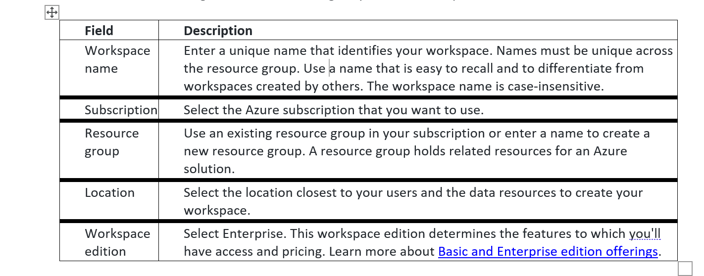

**Keep this information saved for future use.**

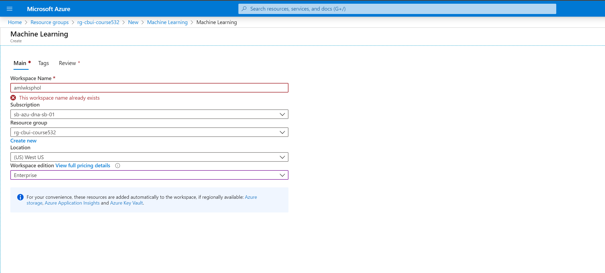

-   When you\'re finished configuring the workspace, select **Review +
    Create**.

-   Review the settings and make any additional changes or corrections.
    When you\'re satisfied with the settings, select **Create**.

-   To view the new workspace, select **Go to resource**.

## 2.  **Create Compute**

**Create Compute Cluster**

An Azure Machine Learning compute instance (preview) is a fully managed
cloud-based workstation for data scientists. Compute instances make it
easy to get started with Azure Machine Learning development as well as
provide management and enterprise readiness capabilities for IT
administrators. Use a compute instance as your fully configured and
managed development environment in the cloud. Compute instances are
typically used as development environments. They can also be used as a
compute target for training and inferencing for development and testing.
For large tasks, an [Azure Machine Learning compute
cluster](https://docs.microsoft.com/en-us/azure/machine-learning/how-to-set-up-training-targets#amlcompute) with
multi-node scaling capabilities is a better compute target choice.

We will do several actions that require a compute target to be executed
on. We will start by creating a cluster of CPUs VMs.

-   Sign in at [https://ml.azure.com](https://ml.azure.com/).

-   Select Compute in the Assets section of the left pane.

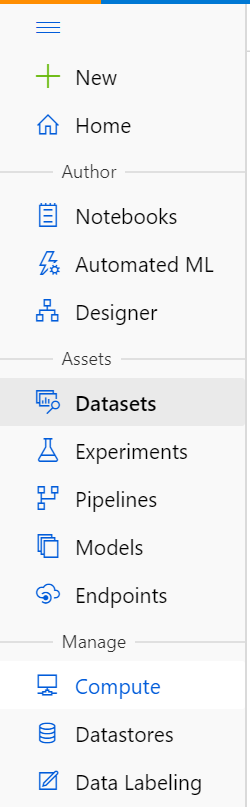 

-   Navigate to Compute \> Compute Clusters in the Manage section and
    click New.

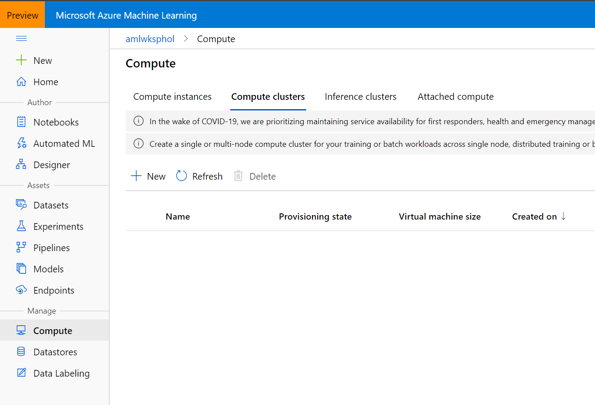 

-   **Name** the cluster cpucluster.

-   **Virtual machine type** CPU

-   For **machine size** choose Standard_DS2_v2.

-   Set the **Minimum number of nodes** to 0 and the **Maximum number of
    nodes** to 4. That way the cluster will scale automatically to up to
    4 nodes as jobs require them.

-   Set the **Idle seconds before scaling down** to 600. That means that
    nodes will be kept around for 10 minutes before they are spun down.
    That way, during our workshop, jobs will not have to wait for
    spin-up. Make sure that number is lower if you are using a more
    expensive VM size.

 

-   Click Create.

-   Wait for the provisioning state to be "Succeeded"

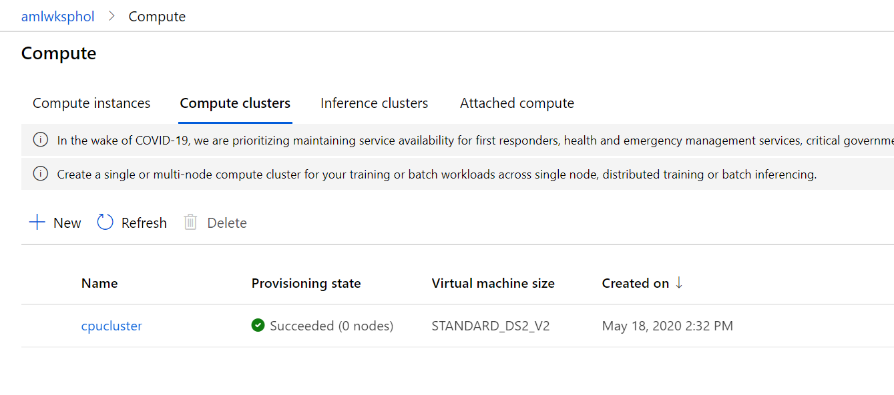 

**Create Compute Instance**

Next, we will create a Compute Instance. The Compute Instance will serve
as an interactive workstation in the cloud that serves as a Jupyter
server, but also hosts and instance of RStudio server and can run
TensorBoard, Bokeh, Shiny or other apps used during the development work
of a Data Scientist.

-   Navigate to Compute Instances tab in the Compute section and click
    on New.

> 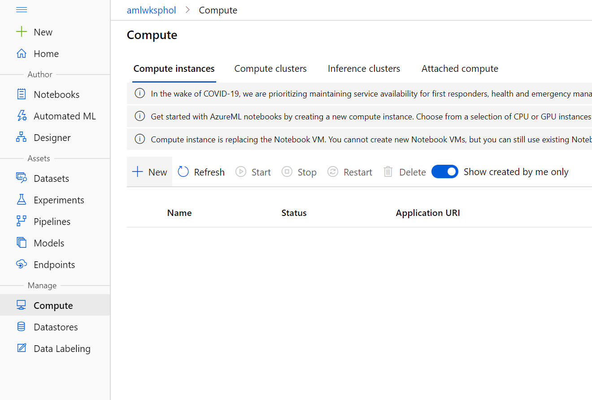 
-   Choose some sufficiently unique name, keep the default VM type
    (STANDARD_DS3_V2 - a fairly inexpensive machine type costing).

> 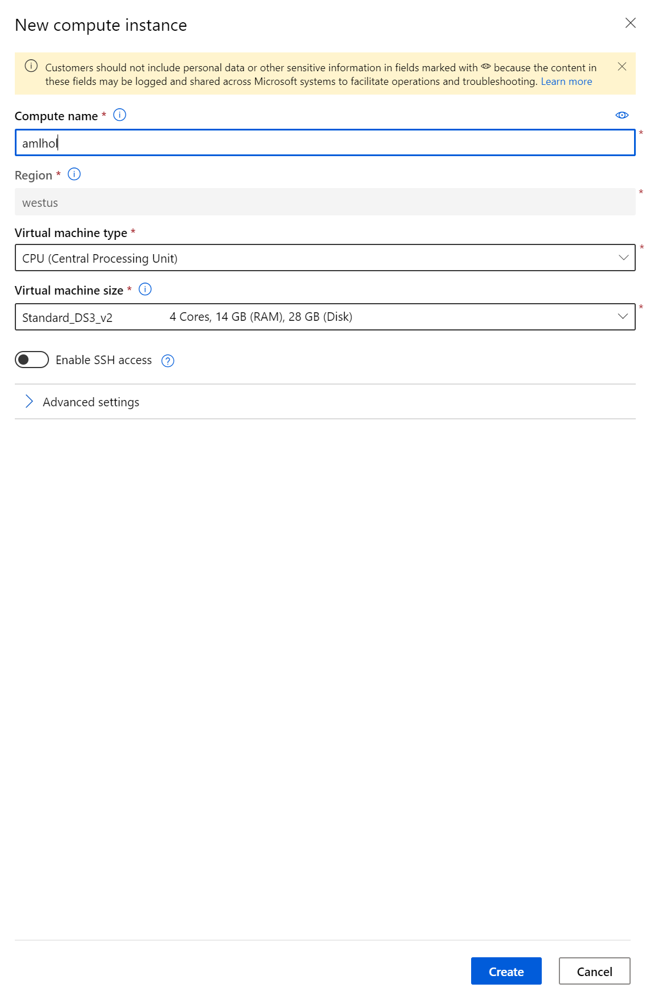 

-   Click Create.

-   Wait for it to change the status to "Running".

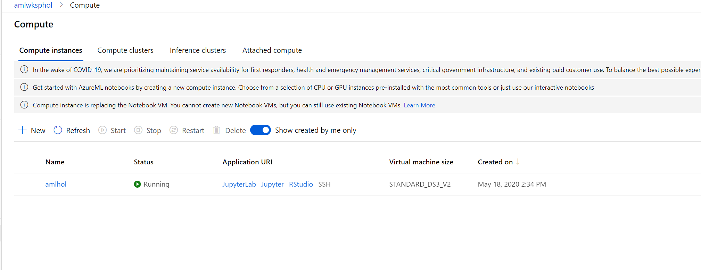 

-   **Note that this machine will keep running until you stop it!**

> 
## **3. Create Dataset**

With Azure Machine Learning datasets, you can:

-   Keep a single copy of data in your storage, referenced by datasets.

-   Seamlessly access data during model training without worrying about
    connection strings or data paths.

-   Share data and collaborate with other users.

There are two dataset types, based on how users consume them in
training:

-   [TabularDataset ](https://docs.microsoft.com/python/api/azureml-core/azureml.data.tabulardataset?view=azure-ml-py)represents
    data in a tabular format by parsing the provided file or list of
    files. This provides you with the ability to materialize the data
    into a Pandas or Spark DataFrame. You can create
    a TabularDataset object from .csv, .tsv, .parquet, .jsonl files, and
    from SQL query results. For a complete list,
    see [TabularDatasetFactory
    class](https://aka.ms/tabulardataset-api-reference).

-   The [FileDataset ](https://docs.microsoft.com/python/api/azureml-core/azureml.data.file_dataset.filedataset?view=azure-ml-py)class
    references single or multiple files in your datastores or public
    URLs. By this method, you can download or mount the files to your
    compute as a FileDataset object. The files can be in any format,
    which enables a wider range of machine learning scenarios, including
    deep learning.

Once you have created an instance of Azure Machine Learning, select
\'Launch Azure Machine Learning studio\' (or browse to
<https://ml.azure.com/>)

By creating a dataset, you create a reference to the data source
location, along with a copy of its metadata. To create a dataset in the
studio:

-   Sign in at [https://ml.azure.com](https://ml.azure.com/).

-   Select Datasets in the Assets section of the left pane.

> 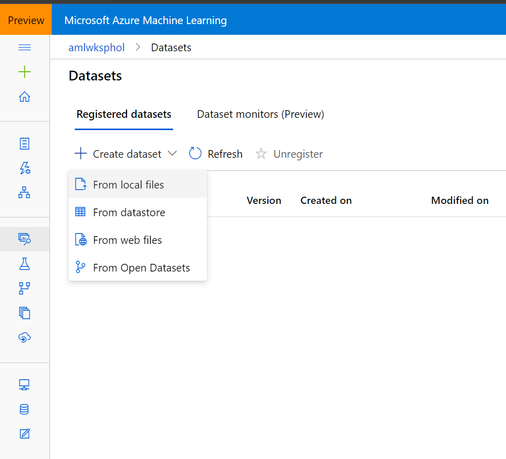 

-   Select Create Dataset to choose the source of your dataset. This
    source can be local files, a datastore, or public URLs. For our
    workshop we will upload the data from local files. You can download
    the dataset from
    [here](https://github.com/shkumar64/AzureMachineLearningWorkshop/blob/master/dataset/HR-Employee-Attrition.csv).

> 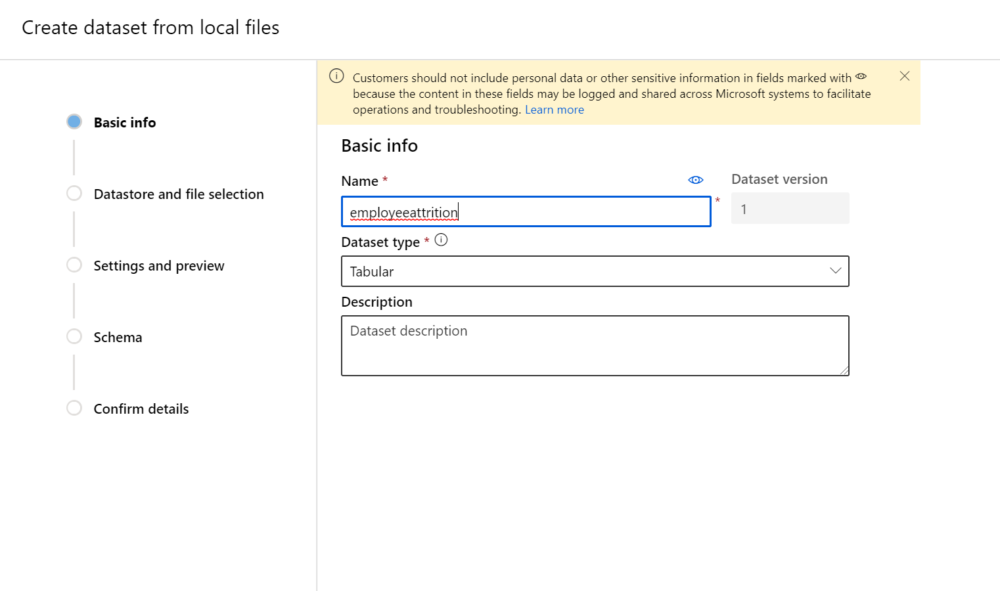

-   Select Tabular for Dataset type and give your dataset a name.

>  
-   Select Next to open the Datastore and file selection form. On this
    form you select where to keep your dataset after creation, as well
    as select what data files to use for your dataset. Select Browse and
    upload the file from your local desktop. Keep rest of the default
    values.

> 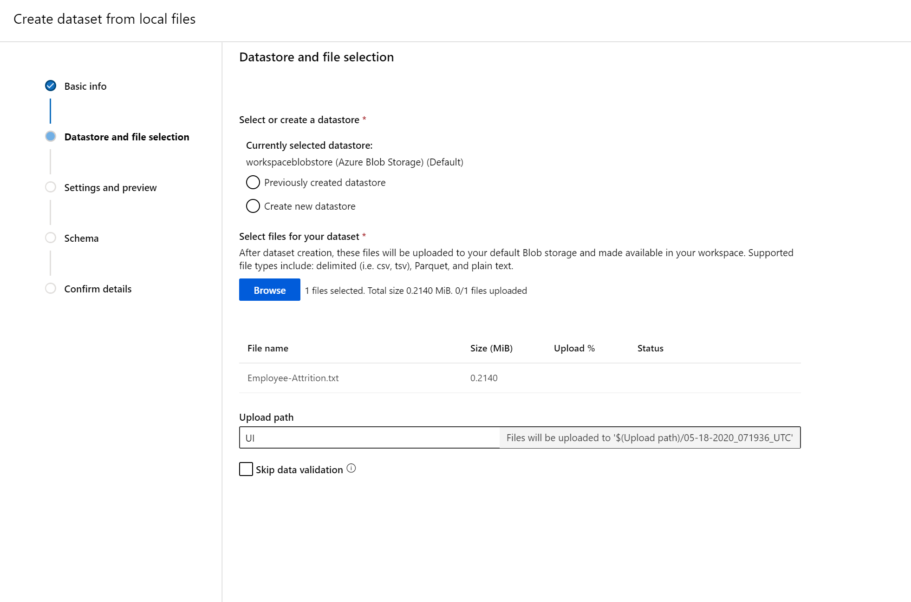 

-   Select Next to populate the Settings and preview and Schema forms;
    they are intelligently populated based on file type and you can
    further configure your dataset prior to creation on these forms.
    Change the Column header to "All files have same header". Ensure the
    rest of the setting and preview of the data.

> 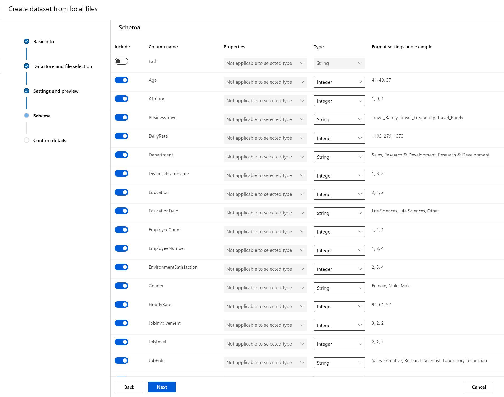 

-   Select Next to review the Schema and Data type.

> 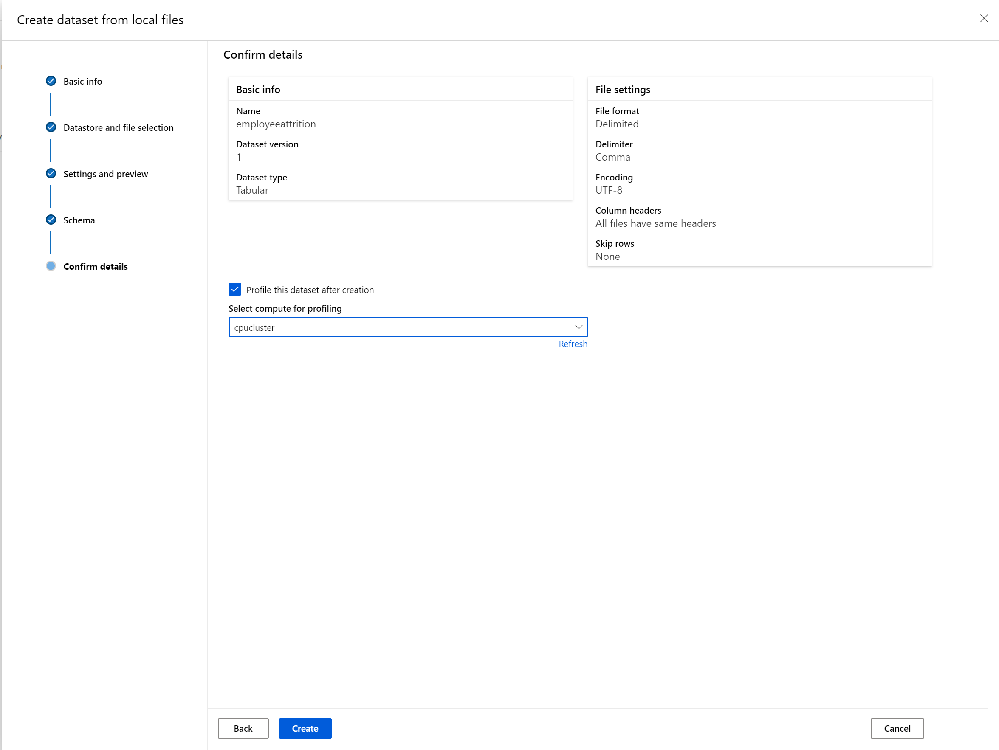 

-   Select Next to review the Confirm details form. Check your
    selections and create an data profile for your dataset. Learn more
    about [data
    profiling](https://docs.microsoft.com/en-us/azure/machine-learning/how-to-use-automated-ml-for-ml-models#profile).

>  

-   Select Create to complete your dataset creation.

-   Dataset should be registered and available for use.

> 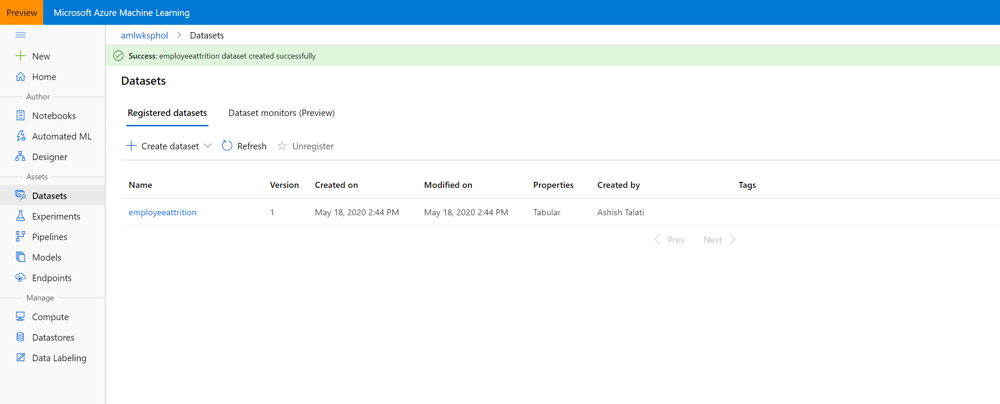 

-   You can register a new dataset under the same name by creating a new
    version. A dataset version is a way to bookmark the state of your
    data so that you can apply a specific version of the dataset for
    experimentation or future reproduction. Learn more about [dataset
    versions](https://docs.microsoft.com/en-us/azure/machine-learning/how-to-version-track-datasets).

-   Once the data profile is completed (profile generation), you can get
    a vast variety of summary statistics across your data set to verify
    whether your data set is ML-ready. For non-numeric columns, they
    include only basic statistics like min, max, and error count. For
    numeric columns, you can also review their statistical moments and
    estimated quantiles.

+----------------------+----------------------------------------------+
| > **Statistic**      | > **Description**                            |
+======================+==============================================+
| > Feature            | > Name of the column that is being           |
|                      | > summarized.                                |
+----------------------+----------------------------------------------+
| > Profile            | > In-line visualization based on the type    |
|                      | > inferred. For example, strings, booleans,  |
|                      | > and dates will have value counts, while    |
|                      | > decimals (numerics) have approximated      |
|                      | > histograms. This allows you to gain a      |
|                      | > quick understanding of the distribution of |
|                      | > the data.                                  |
+----------------------+----------------------------------------------+
| > Type distribution  | > In-line value count of types within a      |
|                      | > column. Nulls are their own type, so this  |
|                      | > visualization is useful for detecting odd  |
|                      | > or missing values.                         |
+----------------------+----------------------------------------------+
| > Type               | > Inferred type of the column. Possible      |
|                      | > values include: strings, booleans, dates,  |
|                      | > and decimals.                              |
+----------------------+----------------------------------------------+
| > Min                | > Minimum value of the column. Blank entries |
|                      | > appear for features whose type does not    |
|                      | > have an inherent ordering (e.g. booleans). |
+----------------------+----------------------------------------------+
| > Max                | > Maximum value of the column.               |
+----------------------+----------------------------------------------+
| > Count              | > Total number of missing and non-missing    |
|                      | > entries in the column.                     |
+----------------------+----------------------------------------------+
| > Not missing count  | > Number of entries in the column that are   |
|                      | > not missing. Empty strings and errors are  |
|                      | > treated as values, so they will not        |
|                      | > contribute to the \"not missing count.\"   |
+----------------------+----------------------------------------------+
| > Quantiles          | > Approximated values at each quantile to    |
|                      | > provide a sense of the distribution of the |
|                      | > data.                                      |
+----------------------+----------------------------------------------+
| > Mean               | > Arithmetic mean or average of the column.  |
+----------------------+----------------------------------------------+
| > Standard deviation | > Measure of the amount of dispersion or     |
|                      | > variation of this column\'s data.          |
+----------------------+----------------------------------------------+
| > Variance           | > Measure of how far spread out this         |
|                      | > column\'s data is from its average value.  |
+----------------------+----------------------------------------------+
| > Skewness           | > Measure of how different this column\'s    |
|                      | > data is from a normal distribution.        |
+----------------------+----------------------------------------------+
| > Kurtosis           | > Measure of how heavily tailed this         |
|                      | > column\'s data is compared to a normal     |
|                      | > distribution.                              |
+----------------------+----------------------------------------------+

> 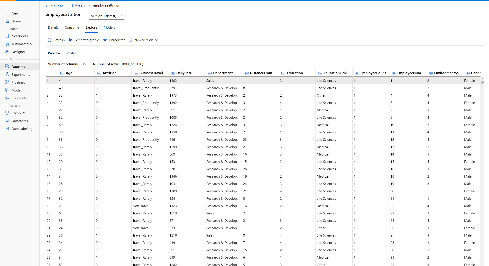 

-   Now, click on the newly created dataset and click Explore. Here you
    can see the fields of the Tabular dataset.

> 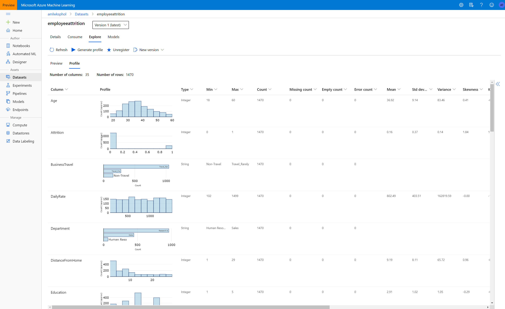 
>
> To view the profile of the dataset we generated in the previous step,
> click the Profile tab. If you want to
>
> regenerate a profile (or you created the dataset without selecting the
> profile option), you can click Generate profile and select a cluster
> to generate profile information for the dataset.
>
>  

-   In the Consume tab we can find a short code snippet for consuming
    the dataset from Notebooks.

> 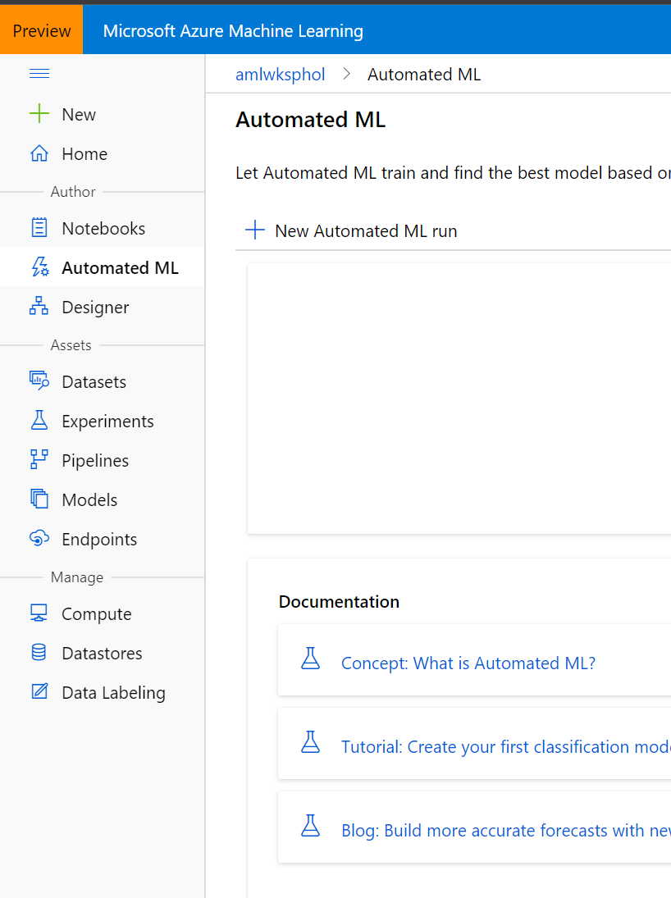 

-   For more information on datasets, see the [how-to for more
    information on creating and using
    Datasets](https://docs.microsoft.com/en-us/azure/machine-learning/service/how-to-create-register-datasets).

> ## **4. Automated Machine Learning**

Automated machine learning (automated ML) builds high quality machine
learning models for you by automating model and hyperparameter
selection. Bring a labelled dataset that you want to build a model for,
and automated ML will give you a high quality machine learning model
that you can use for predictions.

If you are new to Data Science, automated ML will help you get
jumpstarted by simplifying machine learning model building. It abstracts
you from needing to perform model selection, hyperparameter selection
and in one step creates a high-quality trained model for you to use.

If you are an experienced data scientist, automated ML will help
increase your productivity by intelligently performing the model and
hyperparameter selection for your training and generates high quality
models much quicker than manually specifying several combinations of the
parameters and running training jobs. Automated ML provides visibility
and access to all the training jobs and the performance characteristics
of the models to help you further tune the pipeline if you desire.

Follow the instructions in
the [documentation](https://docs.microsoft.com/en-us/azure/machine-learning/how-to-use-automated-ml-for-ml-models) for
a full overview of the user interface.

-   Navigate to the left pane of your workspace. Select Automated
    ML under the Author section.

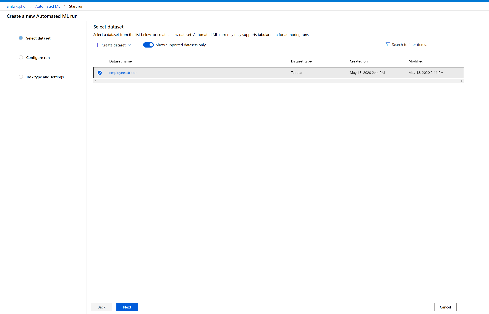 

-   Select New Automated ML run and select the employeeattrition dataset
    that you had created earlier.

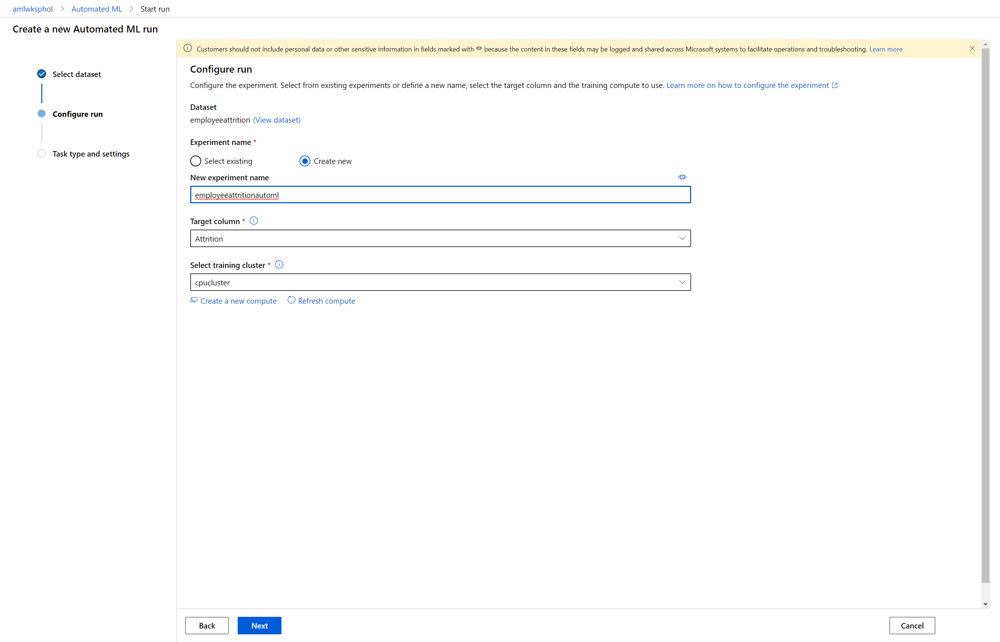 

-   Select Next

-   Enter the Experiment name, select the target column Attrition (this
    is what we want to predict), and select the cluster cpucluster which
    you\'ve created earlier.

 

-   Select Next

-   Keep the task type as "classification"

-   Select view additional configuration.

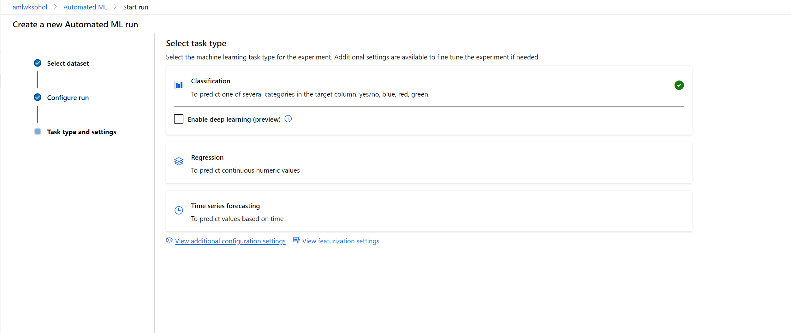 

-   Set the Primary
    [metric ](https://docs.microsoft.com/en-us/azure/machine-learning/how-to-configure-auto-train#primary-metric)to AUC_weighted,
    the training job time to 0.25 and Max concurrent
    iterations to 4 (sufficient for the workshop). The concurrency
    parameter defines how many nodes of your cluster will be used for
    training.

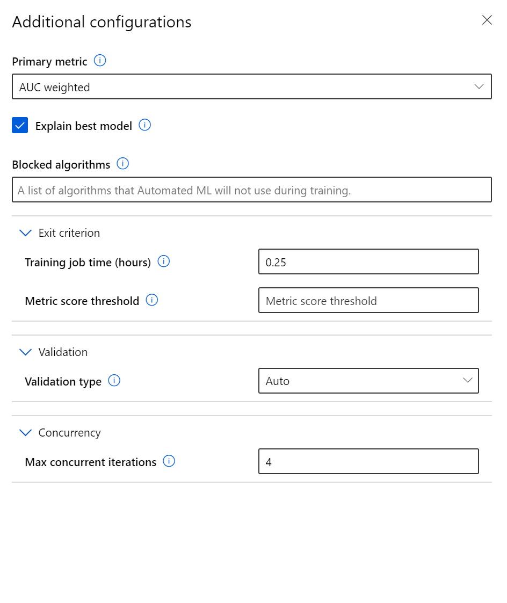 

-   Click Save

-   Hit Finish and wait for the training job to start. You\'ll be able
    to see the models which are created during the run, click on any of
    the models to open the detailed view of that model, where you can
    analyze the [graphs and
    metrics](https://docs.microsoft.com/en-us/azure/machine-learning/service/how-to-understand-automated-ml).

-   Once the run is completed( Should take about 17 minutes) ,
    click Deploy best model to create a deployed endpoint from the
    model.

-   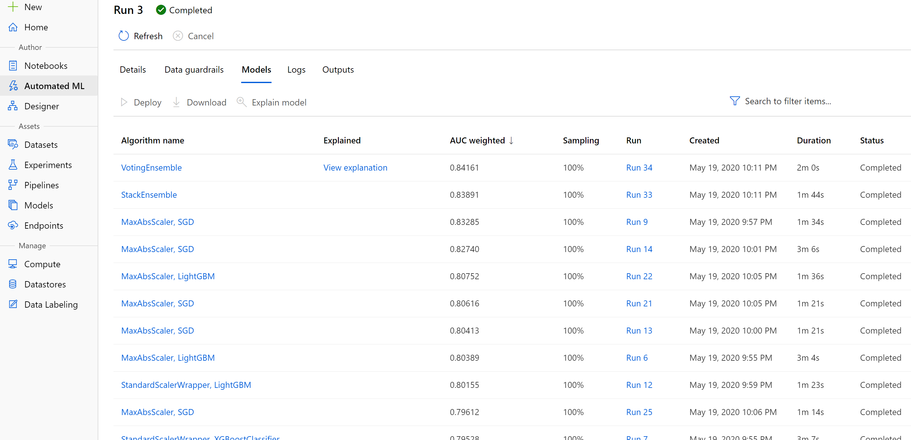 

-   Once the model is deployed, you can consume that API in any client.
    For instance, you can call the API from Postman. Go to EndPoints in
    AML assets

-    

-   Go to consume tab and find the URL Endpoint and key(if
    authentication was enabled)

-   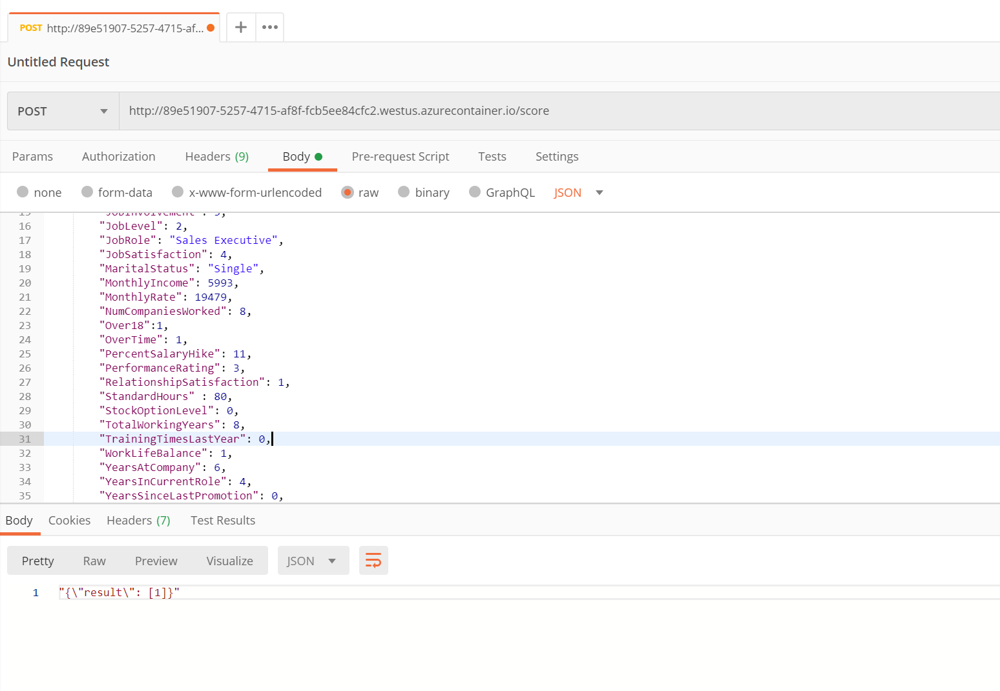

-   Open Postman and create a new HTTP Post for that Rest Endpoint and
    send following HTTP Body

 
> {
>
> \"data\": \[{
>
> \"Age\": 41,
>
> \"BusinessTravel\": \"Travel_Rarely\",
>
> \"DailyRate\": 1102,
>
> \"Department\": \"Sales\",
>
> \"DistanceFromHome\": 1,
>
> \"Education\": 2,
>
> \"EducationField\": \"Life Sciences\",
>
> \"EmployeeCount\" : 1,
>
> \"EmployeeNumber\" : 1,
>
> \"EnvironmentSatisfaction\": 2,
>
> \"Gender\": \"Female\",
>
> \"HourlyRate\": 94,
>
> \"JobInvolvement\": 3,
>
> \"JobLevel\": 2,
>
> \"JobRole\": \"Sales Executive\",
>
> \"JobSatisfaction\": 4,
>
> \"MaritalStatus\": \"Single\",
>
> \"MonthlyIncome\": 5993,
>
> \"MonthlyRate\": 19479,
>
> \"NumCompaniesWorked\": 8,
>
> \"Over18\":1,
>
> \"OverTime\": 1,
>
> \"PercentSalaryHike\": 11,
>
> \"PerformanceRating\": 3,
>
> \"RelationshipSatisfaction\": 1,
>
> \"StandardHours\" : 80,
>
> \"StockOptionLevel\": 0,
>
> \"TotalWorkingYears\": 8,
>
> \"TrainingTimesLastYear\": 0,
>
> \"WorkLifeBalance\": 1,
>
> \"YearsAtCompany\": 6,
>
> \"YearsInCurrentRole\": 4,
>
> \"YearsSinceLastPromotion\": 0,
>
> \"YearsWithCurrManager\": 5
>
> }\]
>
> }

To learn more about automated ML, see
documentation [here](https://docs.microsoft.com/en-us/azure/machine-learning/service/concept-automated-ml).

**Optional Tasks:**

-   Once your model has been deployed, follow
    these [[instructions]{.ul}](https://docs.microsoft.com/en-us/power-bi/service-machine-learning-integration) to
    consume the model from Power BI.

-   Feature engineering: Auto ML also allows you to do feature
    engineering before starting the run. You can checkout this
    Featurization option on the start run page.

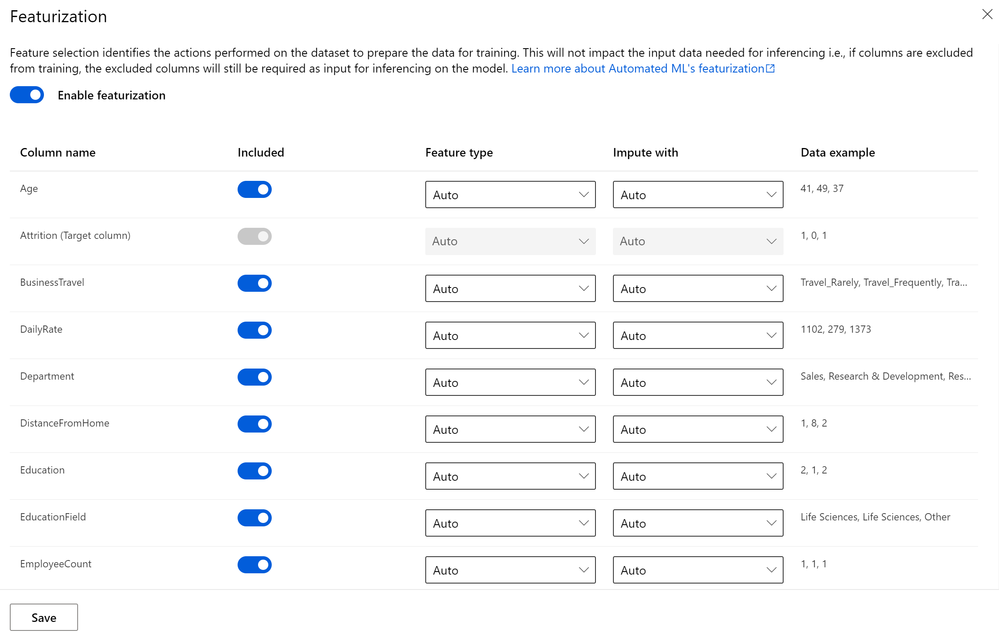 

Try the [[sample
notebooks]{.ul}](https://github.com/Azure/MachineLearningNotebooks/tree/master/how-to-use-azureml/automated-machine-learning).

> ## **5. Azure Machine Learning Designer**

Azure Machine Learning designer lets you visually
connect [datasets ](https://docs.microsoft.com/en-us/azure/machine-learning/concept-designer#datasets)and [modules ](https://docs.microsoft.com/en-us/azure/machine-learning/concept-designer#module)on
an interactive canvas to create machine learning models.

The designer uses your Azure Machine
Learning [workspace](https://docs.microsoft.com/en-us/azure/machine-learning/concept-workspace) to
organize shared resources such as:

-   [Pipelines](https://docs.microsoft.com/en-us/azure/machine-learning/concept-designer#pipeline)

-   [Datasets](https://docs.microsoft.com/en-us/azure/machine-learning/concept-designer#datasets)

-   [Compute
    resources](https://docs.microsoft.com/en-us/azure/machine-learning/concept-designer#compute)

-   [Registered
    models](https://docs.microsoft.com/en-us/azure/machine-learning/concept-azure-machine-learning-architecture#models)

-   [Published
    pipelines](https://docs.microsoft.com/en-us/azure/machine-learning/concept-designer#publish)

-   [Real-time
    endpoints](https://docs.microsoft.com/en-us/azure/machine-learning/concept-designer#deploy)

The designer gives you a visual canvas to build, test, and deploy
machine learning models. With the designer you can:

Drag-and-drop [datasets](https://docs.microsoft.com/en-us/azure/machine-learning/concept-designer#datasets) and [modules](https://docs.microsoft.com/en-us/azure/machine-learning/concept-designer#module) onto
the canvas.

-   Connect the modules together to create a [pipeline
    draft](https://docs.microsoft.com/en-us/azure/machine-learning/concept-designer#pipeline-draft).

-   Submit a [pipeline
    run](https://docs.microsoft.com/en-us/azure/machine-learning/concept-designer#pipeline-run) using
    the compute resources in your Azure Machine Learning workspace.

-   Convert your training pipelines to inference pipelines.

-   [Publish](https://docs.microsoft.com/en-us/azure/machine-learning/concept-designer#publish) your
    pipelines to a REST pipeline endpoint to submit new pipeline runs
    with different parameters and datasets.

-   Publish a training pipeline to reuse a single pipeline to train
    multiple models while changing parameters and datasets.

-   Publish a batch inference pipeline to make predictions on new data
    by using a previously trained model.

-   [Deploy](https://docs.microsoft.com/en-us/azure/machine-learning/concept-designer#deploy) a real-time
    inference pipeline to a real-time endpoint to make predictions on
    new data in real time.

-   In the AML, navigate to the Designer tab under the Author section
    and launch it.

-   Create a new experiment by click +

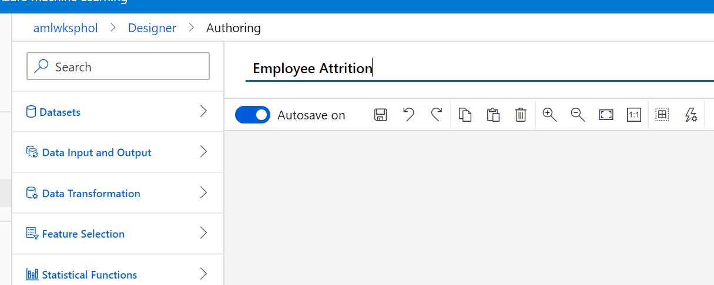

-   Rename the pipeline to Employee Attrition

 

-   Select the compute target to the one that you created earlier. Click
    Save.

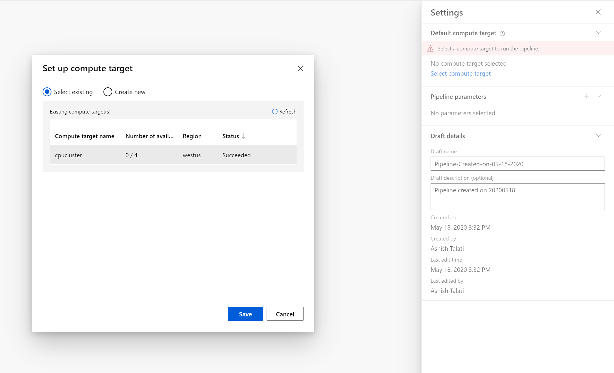 

-   Click "X" to close the property window

-   Expand Datasets -\> My DataSets and select employeeattrition dataset
    that was created earlier.

-   Drag the employeeatrition dataset module into the pipeline canvas.

 

-   Add "Select Columns in Dataset" module to remove "EmployeeCount,
    EmployeeNumber, Over18 and StandardHours" columns.

-   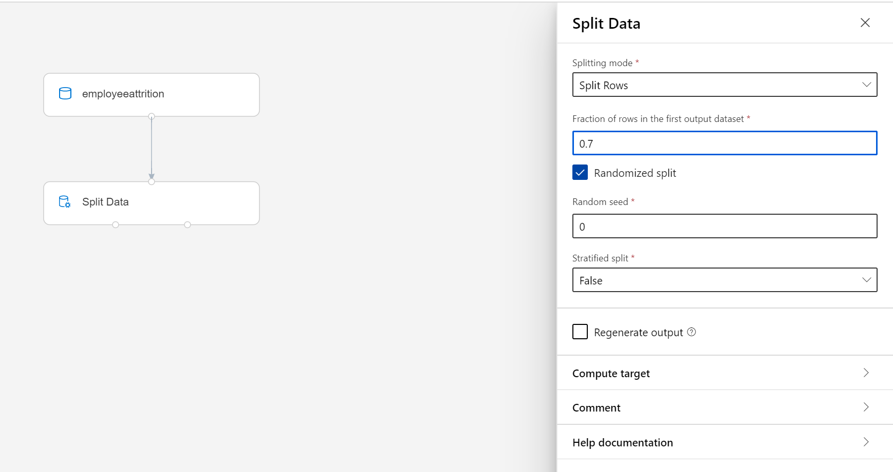 

-   Add a Split Data module to create the training and test sets. Set
    the fraction of rows in the first output dataset to 0.7. This
    setting specifies that 70% of the data will be output to the left
    port of the module and the rest to the right port. We use the left
    dataset for training and the right one for testing.

-   Add a Two-Class Logistics Regression module to initialize a boosted
    decision tree classifier.

-   Add a Train Model module. Connect the classifier from the previous
    step to the left input port of the Train Model. Connect the filtered
    dataset from Filter Based Feature Selection module as training
    dataset. Add the target column as Attrition in the label Column
    option. (**Column names: Attrition**) The Train Model will train the
    classifier.

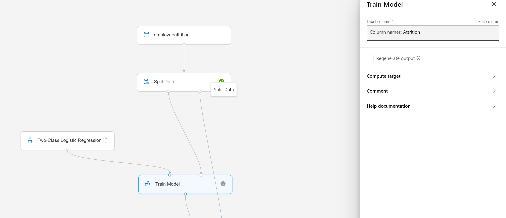 

-   Add **Score Model** module and connect the **Train Model** module to
    it. Then add the test set (the output of Filter Based Feature
    Selection module which apply feature selection to test set too) to
    the **Score Model**. The **Score Model** will make the predictions.
    You can select its output port to see the predictions and the
    positive class probabilities.

-   Add an Evaluate Model module and connect the scored dataset to its
    left input port. To see the evaluation results, select the output
    port of the Evaluate Model module and select Visualize.

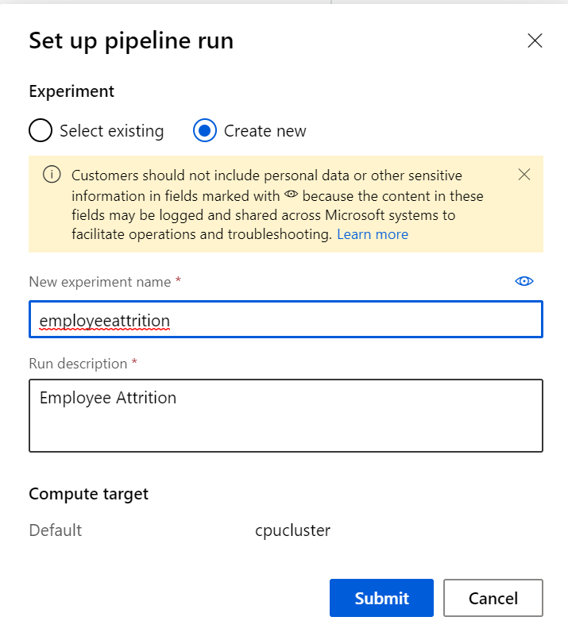 

-   Click Submit at the top and give your experiment a name.

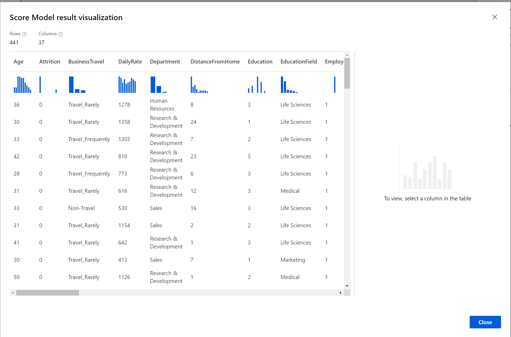 

-   Once you ran the experiment, you can inspect the outputs of the
    individual steps - check out the output of the different steps, the
    last one by right-clicking it and selecting Visualize Scored
    dataset.

> 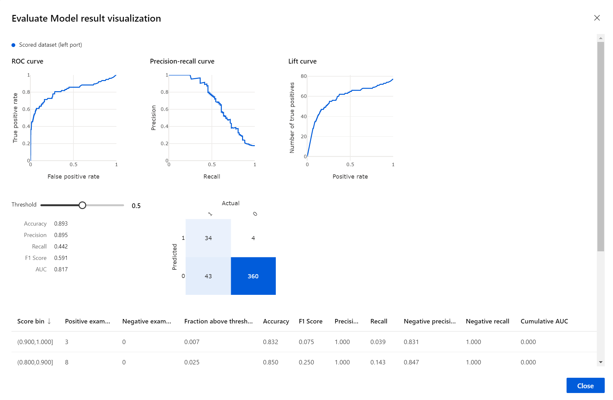 >
>  using
a familiar Jupyter notebook in a secure, enterprise-ready environment.
Notebook VM is secure and easy-to-use, preconfigured for machine
learning, and fully customizable.

 

Key features Azure Machine Learning service Notebook VMs are:

-   **Secure** -- provides AAD login integrated with the AML Workspace,
    provides access to files stored in the workspace, implicitly
    configured for the workspace.

-   **Preconfigured** -- with Jupyter, JupyterLab, up-to-date AML Python
    Environment, GPU drivers, Tensorflow, Pytorch, Scikit learn, etc.
    (uses DSVM under the hood)

-   **Simple to set up** -- created with a few clicks in the AML
    workspace portal, managed from within the AML workspace portal.

-   **Customizable **-- use CPU or GPU machine types, install your own
    tools (or drivers), ssh to the machine, changes persist across
    restarts.

The Notebook VM creation experience has been streamlined, as it takes
just two parameters

-- a VM name and a VM type.

 

Once the Notebook VM is created it provides access to Jupyter,
JupyterLab and R Studio -- popular notebook environments for data
science.

 

The access to the notebooks is secured out-of-the-box with HTTPS and
Azure Active Directory, which makes it possible for IT pros to enforce a
single sign-on environment with strong security features like
Multi-Factor Authentication, ensuring a secure environment in compliance
with organizational policies.

 

Notebook VM has the most up-to-date, compatible packages preconfigured
and ready to use. This way, data scientists can use any of the latest
frameworks on Notebook VM without versioning issues and with access to
all the latest functionality of Azure Machine Learning service. Inside
of the VM, along with Jupyter and JupyterLab, data scientists will find
a fully prepared environment for machine learning.

 

Notebook VM  comes equipped with preconfigured GPU drivers and a
selection of ML and Deep Learning Frameworks. Notebook VM is also
integrated with its parent, [Azure Machine Learning
workspace](https://docs.microsoft.com/en-us/azure/machine-learning/studio/create-workspace).
The notebooks that data scientists run on the VM have access to the data
stores and compute resources of the workspace. The notebooks themselves
are stored in a Blob Storage account of the workspace. This makes it
easy to share notebooks between VMs, as well as keeps them safely
preserved when the VM is deleted.

**[Clone Git Repo]{.ul}**

For the following parts of the workshop, you are going to work on the
Compute Instance you provisioned earlier. For that, you will need to
clone this git repository onto the workspace.

-   Click on Compute -\> Compute instance

-   To get started, first navigate to the JupyterLab instance running on
    the Notebook VM by clicking on the JupyterLab link shown below

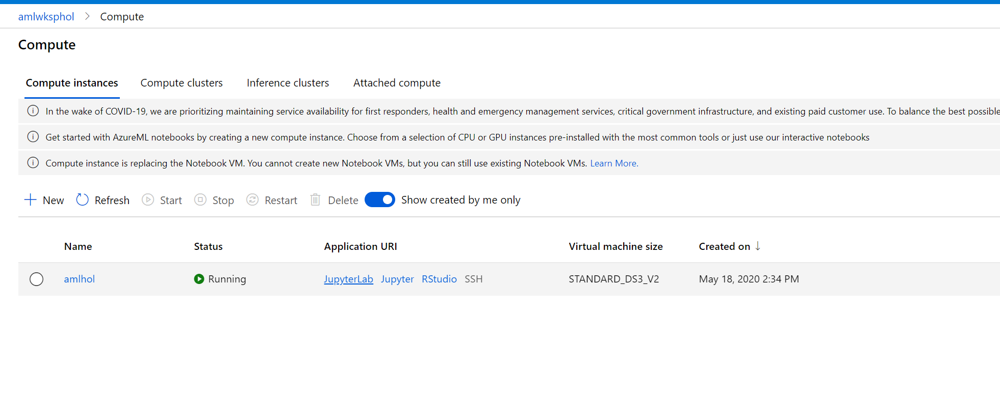 
-   After going through authentication, you will see the JupyterLab
    frontend. As you authenticate, make sure to use the same user to log
    in as was used to create the Compute Instance, or else your access
    will be denied. Next open an Terminal (either by File -\> New -\>
    Terminal, or by just clicking on Terminal in the Launcher Window).

 
-   In the terminal window clone Navigate to your directory (Users/X.X/
    ) and then clone this repository by typing:

> git clone
> https://github.com/shkumar64/AzureMachineLearningWorkshop.git

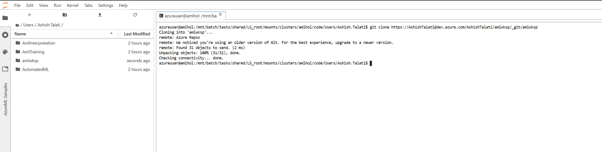 
-   Go back to Azure ML homepage and click on Notebooks. You should see
    amlwksp directory created with additional subdirectory in there with
    the Azure ML notebooks

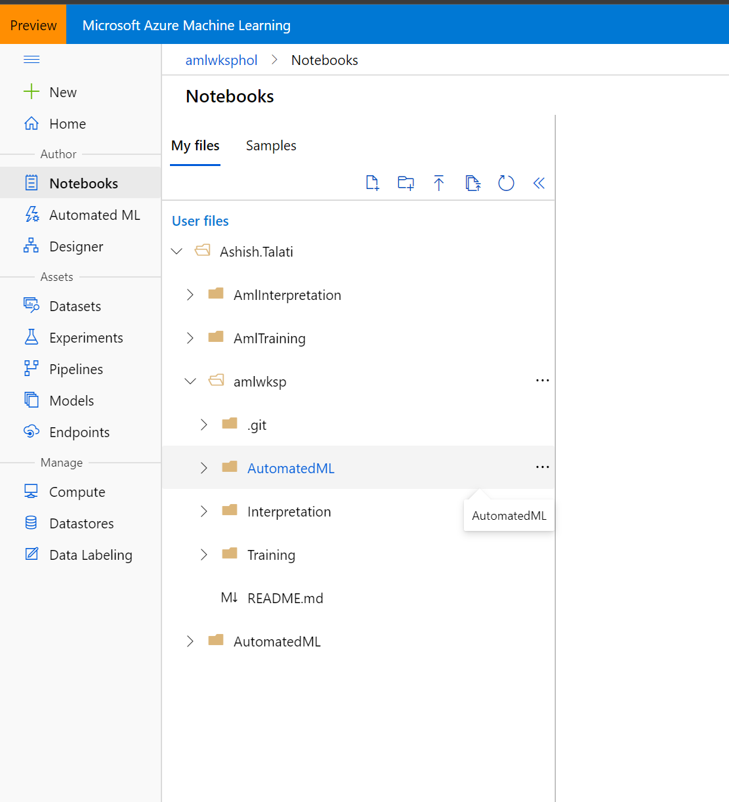 

**Following are the notebook that you can execute using SDK and research
further:**

Change following notebooks with details from section 1

amlwksp/AutomatedML/binayclassification-employee-attrition-autoaml-local-compute.ipynb

amlwksp/Deployment/deploy-attrition-model.ipynb

amlwksp/Interpretation/2-explain-model-on-amlcompute.ipynb

amlwksp/Training/binayclassification-employee-attrition-notebook.ipynb

Look for the cell with following details

from azureml.core import Workspace, Dataset

from azureml.core.authentication import InteractiveLoginAuthentication

interactive_auth = InteractiveLoginAuthentication(tenant_id=\"your tenant id\")

\# Get Workspace defined in by default config.json file

\# ws = Workspace.from_config()

ws = Workspace(subscription_id=\"your subscription id\",

               resource_group=\"your resource group\",

               workspace_name=\"your workspace name\",

               auth=interactive_auth)

Training

-   binayclassification-employee-attrition-notebook.ipynb =\> Notebook
    for plain scikit-learn model training in AML Local compute (AML VM)

Automated ML (Additional information on Automated ML -
<https://docs.microsoft.com/en-us/azure/machine-learning/concept-automated-ml>)

-   binayclassification-employee-attrition-autoaml-local-compute.ipynb
    =\> Notebook for AutoML on local compute

Interpretation (More information on interpretability at
<https://docs.microsoft.com/en-us/azure/machine-learning/how-to-machine-learning-interpretability>)

-   1-simple-feature-transformations-explain-local.ipynb =\> Feature
    transformation and Local Explanation.

-   2-explain-model-on-amlcompute.ipynb =\> Explain model on AML Compute

## **7. Azure ML R SDK and R Studio Interface**

Azure Machine Learning supports R. You can bring in your existing R
codes in to Azure Machine Learning and run it in the same experiment
with provided learners and publish this as web service via Azure Machine
Learning. Azure ML workspace integrates with R studio which allows
seamless access to a R based notebook environment.

-   To access the R Studio navigate to the compute instance created in
    the previous steps and click on R studio.

 

-   The R studio interface will start in the separate window. The bottom
    right pane is the directory browser. Navigate to Users"username"-\>
    "amlworkspace". You should be able to see the directory that we
    cloned in the last exercise

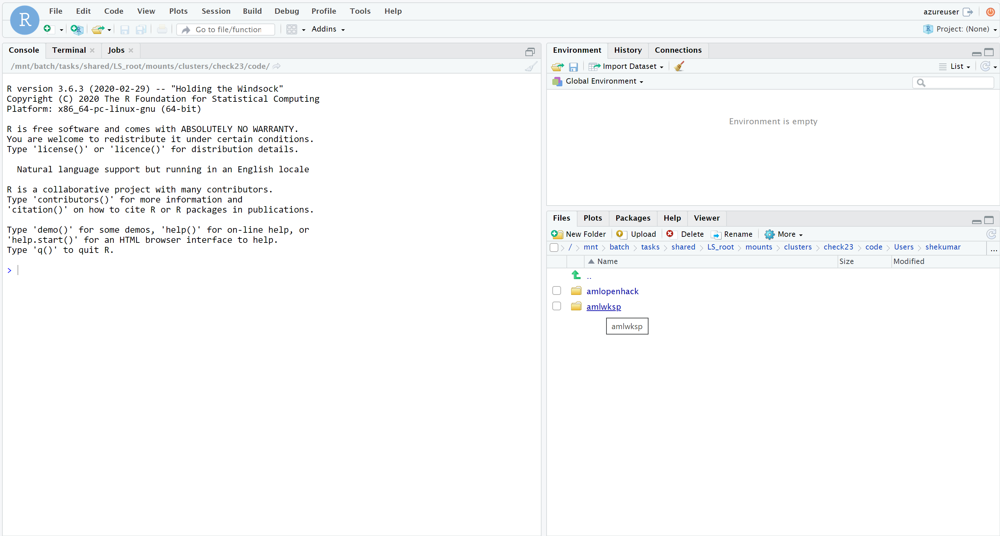 

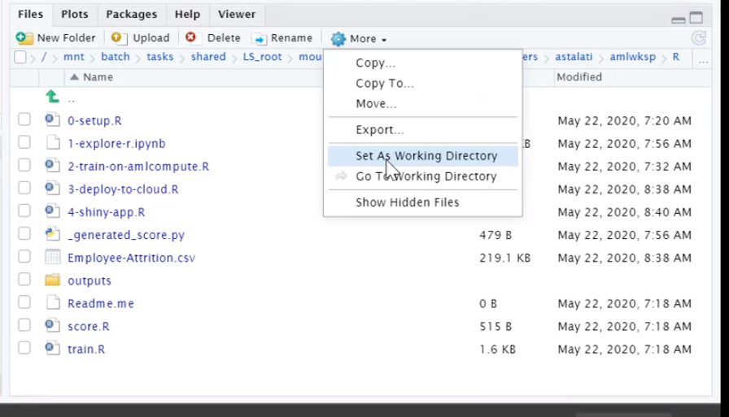 
-   Open the folder named "R". This contains R notebooks that we would
    use through this exercise.

-   Use the "More" menu and select the current directory as working
    directory as in the screenshot below.

 

-   Click on 0-setup.R file to open it in the file pane. You can start
    executing it one by one or all together by selecting all lines in
    the notebook before starting the run. This notebook would install
    all the dependencies needed to run model training and scoring.

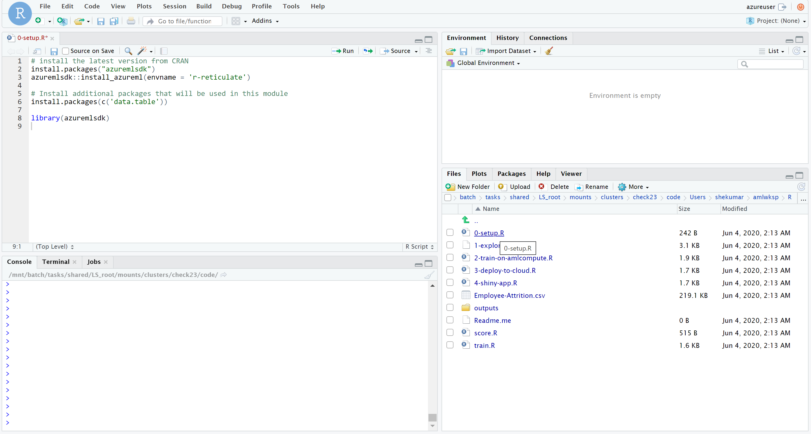 

-   After the setup is done. Open 2-train-onamlcompute.R This notebook
    executes the same logic as python notebook from the last exercise.
    Run commands one by one .

-   Make sure you replace the name of the dataset in line 41 with the
    output of line 39 *print(attrition)*

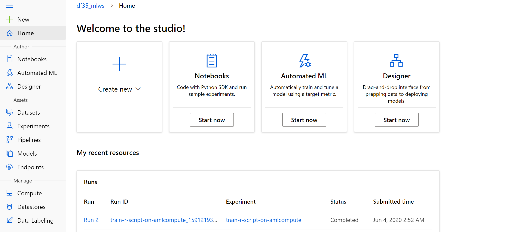
-   If you navigate to your AML workspace you should be able to see the
    ongoing execution of the R script. When the script finishes you
    should be able to print the metrics from the completed run.

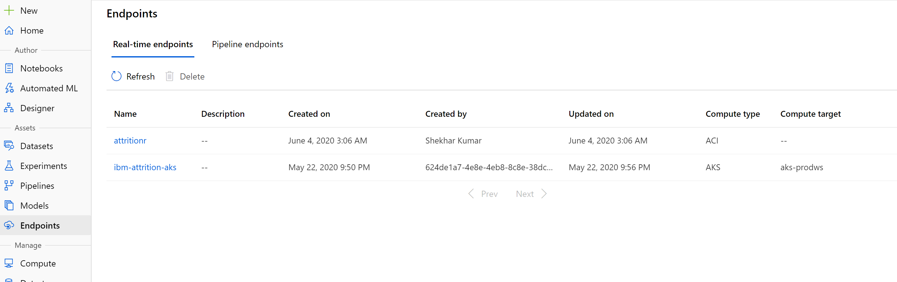 

-   After successfully training the model. Now we need to register the
    model in the AML workspace and deploy it as a container. Open
    3-deploy-to-cloud.R and start executing the notebook. After the
    execution finishes. You would be able to see the model registered
    under "Models" in the AML workspace and also the REST endpoint
    available under "Endpoints". The script also internal calls and
    tests sample data from this endpoint which should be visible in the
    script output

>  

-   With R you can also consume the model with a Shiny App. To use this
    model using shiny-app. Open the notebook 4-shiny-app.R. and click on
    "Run App". Make sure to save all changed files before executing. The
    app should open in a new window and you should be able to see the
    input and output of the model.

> 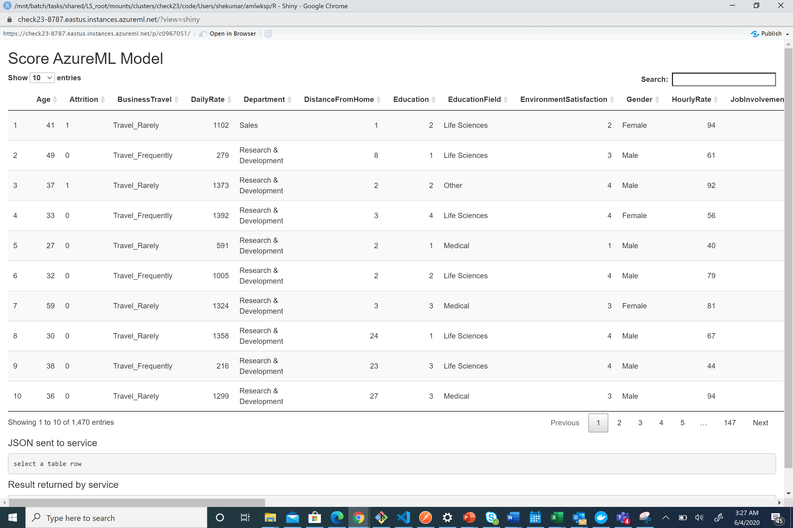 >
> **Optional reading**

-   <https://azure.github.io/azureml-sdk-for-r/index.html>

-   <https://docs.microsoft.com/en-us/azure/machine-learning/tutorial-1st-r-experiment>

## **8. MLOps**

Machine Learning Operations (MLOps) is based
on [DevOps](https://azure.microsoft.com/overview/what-is-devops/) principles
and practices that increase the efficiency of workflows. For example,
continuous integration, delivery, and deployment. MLOps applies these
principles to the machine learning process, with the goal of:

-   Faster experimentation and development of models

-   Faster deployment of models into production

-   Quality assurance

MLOps will help you to understand how to build a Continuous Integration
and Continuous Delivery pipeline for an ML/AI project. We will be using
the Azure DevOps Project for build and release/deployment pipelines
along with Azure ML services for model retraining pipeline, model
management and operationalization.

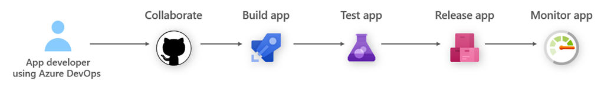 

Azure Machine Learning provides the following MLOps capabilities:

-   **Create reproducible ML pipelines**. Machine Learning pipelines
    allow you to define repeatable and reusable steps for your data
    preparation, training, and scoring processes.

-   **Create reusable software environments** for training and deploying
    models.

-   **Register, package, and deploy models from anywhere**. You can also
    track associated metadata required to use the model.

-   **Capture the governance data for the end-to-end ML lifecycle**. The
    logged information can include who is publishing models, why changes
    were made, and when models were deployed or used in production.

-   **Notify and alert on events in the ML lifecycle**. For example,
    experiment completion, model registration, model deployment, and
    data drift detection.

-   **Monitor ML applications for operational and ML-related issues**.
    Compare model inputs between training and inference, explore
    model-specific metrics, and provide monitoring and alerts on your ML
    infrastructure.

-   **Automate the end-to-end ML lifecycle with Azure Machine Learning
    and Azure Pipelines**. Using pipelines allows you to frequently
    update models, test new models, and continuously roll out new ML
    models alongside your other applications and services.

This is where the Azure Machine Learning shines the most. It presents
the most complete and intuitive model lifecycle management experience
alongside integrating with Azure DevOps and GitHub.

 

Following is the diagrammatic representation below for MLOps with Azure
Machine Learning.

 

[[\
]{.ul}](https://azurecomcdn.azureedge.net/mediahandler/acomblog/media/Default/blog/2f8c2629-32c8-4b27-8fc4-23271c88ef9d.png)

Additional information available at

-   Model Management and Deployment -
    <https://docs.microsoft.com/en-us/azure/machine-learning/concept-model-management-and-deployment>

-   Deployment Options -
    <https://docs.microsoft.com/en-us/azure/machine-learning/service/how-to-deploy-and-where>

-   Event grid Integration -
    <https://docs.microsoft.com/en-us/azure/machine-learning/service/concept-event-grid-integration>

Following is the notebook that you can execute using SDK and research
further:

-   deploy-attrition-model.ipynb =\> Deploy the model to Azure Container
    Instance using Python SDK

**For rest of the workshop we will build the automated training and
deployment using Azure DevOps.**

-   Go to your Azure DevOps project and create a new project

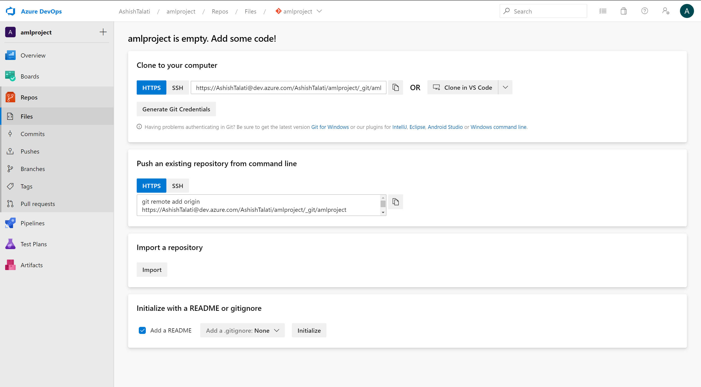 

-   Click Create

-   Click the Repos area. Click on the Git repo dropdown at the top of
    the page and then on \"Import Repository\".

>  

-   Under clone URL, you can
    put <https://github.com/shkumar64/AzureMachineLearningWorkshop>

-   Next, let\'s connect your ML workspace to Azure DevOps. (Note: This
    workshop leverages the **Azure Machine Learning** extension that
    should be installed in your organization from
    the [marketplace](https://marketplace.visualstudio.com/items?itemName=ms-air-aiagility.vss-services-azureml).)

-   In order to set up automated training and deployment, you need to
    create a service connection to your ML workspace. To get there, go
    to your Azure DevOps project settings page (by clicking on the gear
    wheel to the bottom left of the screen), and then click on **Service
    connections** under the **Pipelines** section. The Azure ML
    extension uses an **Azure Resource Manager** service connection.

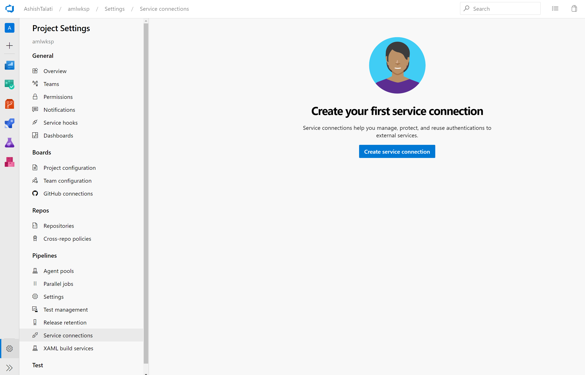 

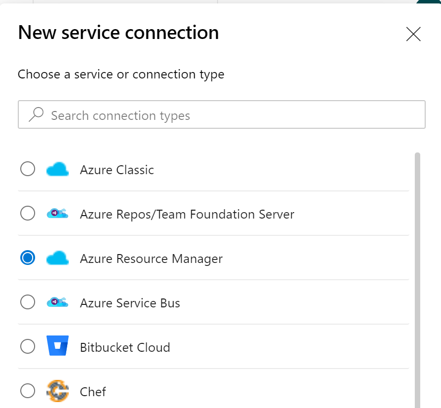 

-   Select Service principal (automatic)

>  

-   **Important:** Make sure you point it to workshop workspace and be
    sure to name the Service connection

-   **Note:** Creating service connection using Azure Machine Learning
    extension requires \'Owner\' or \'User Access Administrator\'
    permissions on the Workspace.

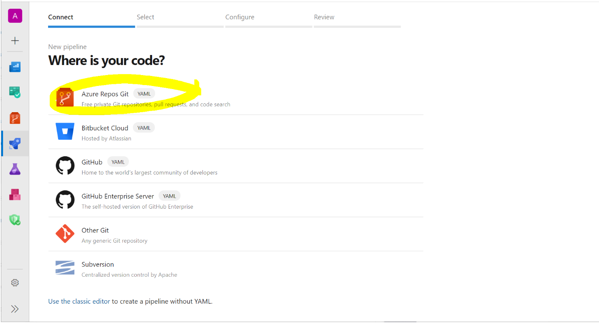 

The first phase of bringing your ML workflow to production is being able
to reproduce and automate the model training process.

In this repo, you will find four pipelines:

-   pipelines/deploy-infrastructure.yml - Provisions a compute cluster
    for performing model training, as well as the AKS cluster for model
    deployment

-   pipelines/train-and-register-model.yml - Trains the model on the
    compute cluster and registers it

-   pipelines/deploy-model.yml - Deploys the model to the AKS cluster

-   pipelines/delete-infrastructure.yml - Deletes the AKS cluster and
    also the compute cluster (just used here for testing here, so that
    you can delete your AKS cluster quickly)

The pipelines derive their configuration variables from:

-   pipelines/config.yml - Contains all names and configuration
    paramters for the pipelines

Goto Pipelines (Rocket symbol), select Create Pipeline and pick Azure
Repos Git:

-    
> Select your repo:

-   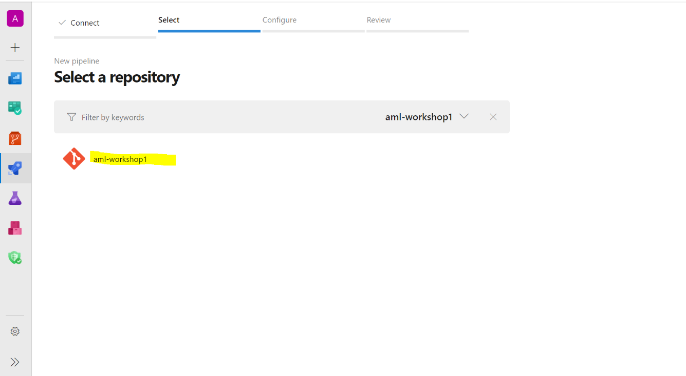 
> Select Existing Azure Pipelines YAML file:

-    
> Select the pipeline /pipelines/deploy-infrastructure.yml from the
> list. Instead of hitting Run, hit the down arrow and select Save:

-   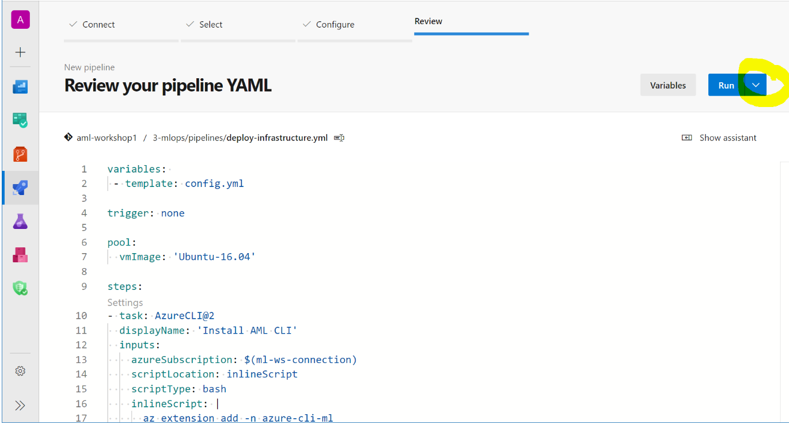 
> Then select the three dots and select Rename:

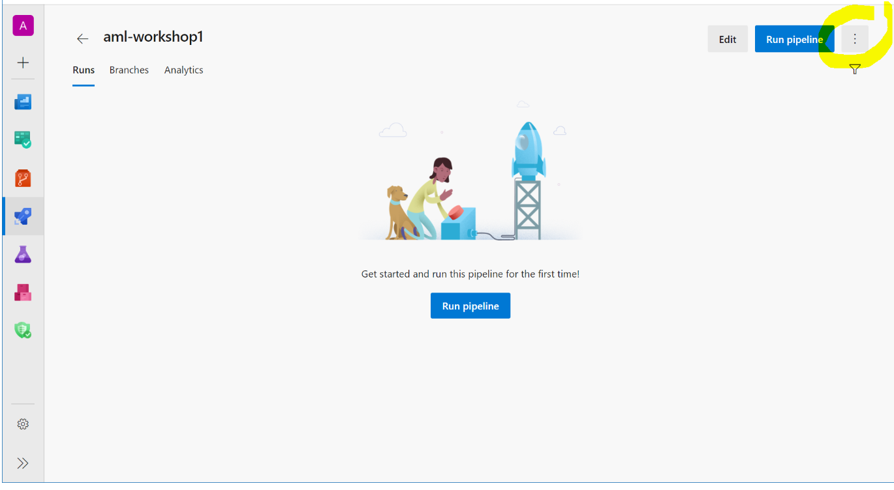 
-   Rename the pipeline to deploy-infrastructure and hit Save:

-   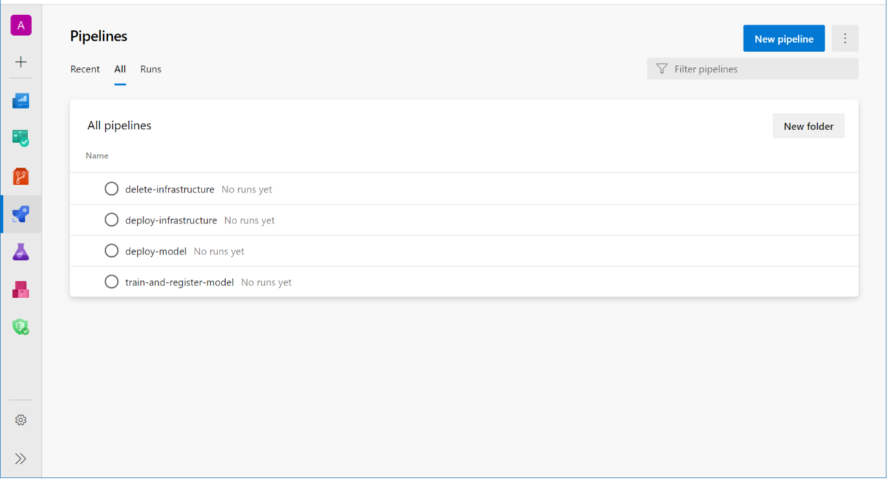 
Repeat the steps above three times and import the following pipelines:

-   /pipelines/train-and-register-model.yml and rename
    to train-and-register-model

-   /pipelines/deploy-model.yml and rename to deploy-model

-   /pipelines/delete-infrastructure.yml and rename
    to delete-infrastructure

Once done, your pipelines should look like this (select All tab):

-    
> For sake of this workshop, we have disabled automatic triggering of
> the pipelines. Hence, we can now manually run three out of the four
> pipelines manually:

-   deploy-infrastructure

-   train-and-register-model

-   deploy-model

The last pipeline delete-infrastructure can be used to get rid of the
AKS cluster (for saving cost).

-   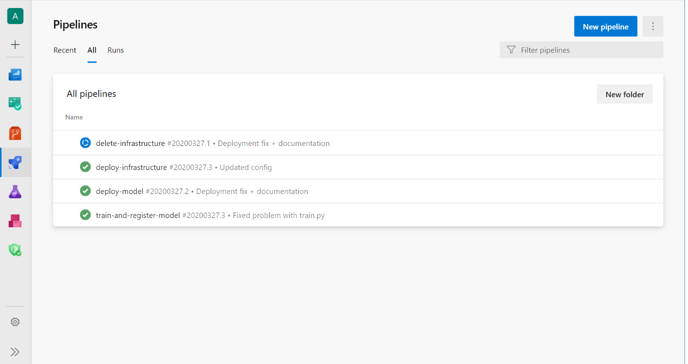
Once all three pipelines ran, we should be able to see in the AzureML
studio:

-   New experiment run should have been created

-   Model should have been registered

-   A new endpoint should have been registered

We can now try out the model by using the Consume tab under the AKS
endpoint:

POST http://\<your endpoint
address\>:80/api/v1/service/ibm-attrition-aks/score HTTP/1.1

Authorization: Bearer \<your key\>

Content-Type: application/json

{

> \"data\": \[{
>
> \"Age\": 41,
>
> \"BusinessTravel\": \"Travel_Rarely\",
>
> \"DailyRate\": 1102,
>
> \"Department\": \"Sales\",
>
> \"DistanceFromHome\": 1,
>
> \"Education\": 2,
>
> \"EducationField\": \"Life Sciences\",
>
> \"EnvironmentSatisfaction\": 2,
>
> \"Gender\": \"Female\",
>
> \"HourlyRate\": 94,
>
> \"JobInvolvement\": 3,
>
> \"JobLevel\": 2,
>
> \"JobRole\": \"Sales Executive\",
>
> \"JobSatisfaction\": 4,
>
> \"MaritalStatus\": \"Single\",
>
> \"MonthlyIncome\": 5993,
>
> \"MonthlyRate\": 19479,
>
> \"NumCompaniesWorked\": 8,
>
> \"OverTime\": \"No\",
>
> \"PercentSalaryHike\": 11,
>
> \"PerformanceRating\": 3,
>
> \"RelationshipSatisfaction\": 1,
>
> \"StockOptionLevel\": 0,
>
> \"TotalWorkingYears\": 8,
>
> \"TrainingTimesLastYear\": 0,
>
> \"WorkLifeBalance\": 1,
>
> \"YearsAtCompany\": 6,
>
> \"YearsInCurrentRole\": 4,
>
> \"YearsSinceLastPromotion\": 0,
>
> \"YearsWithCurrManager\": 5
>
> }\]
>
> }

Response:

{\"result\": \[0\]}
